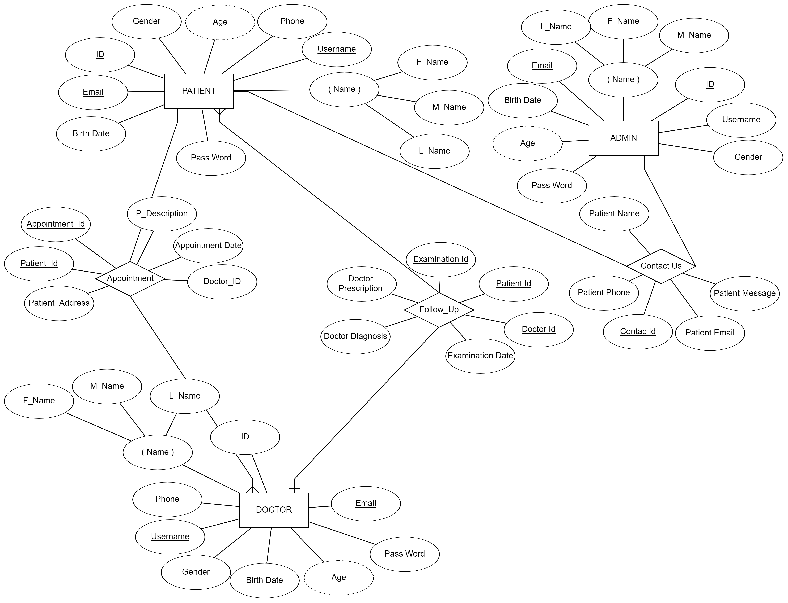
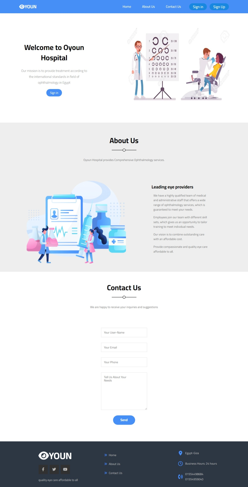
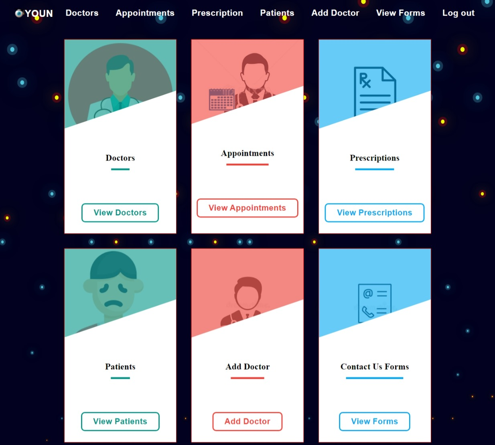
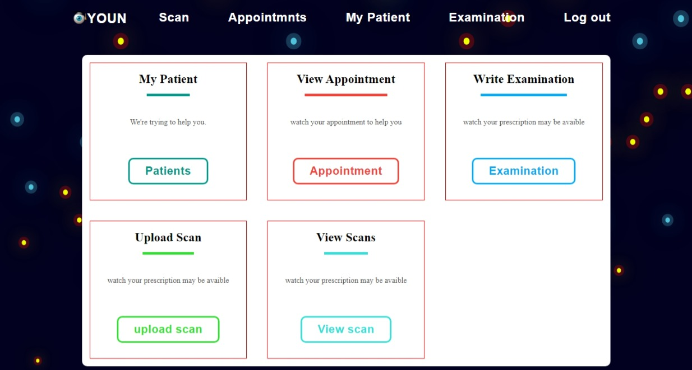
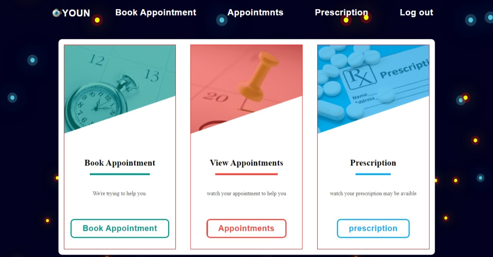
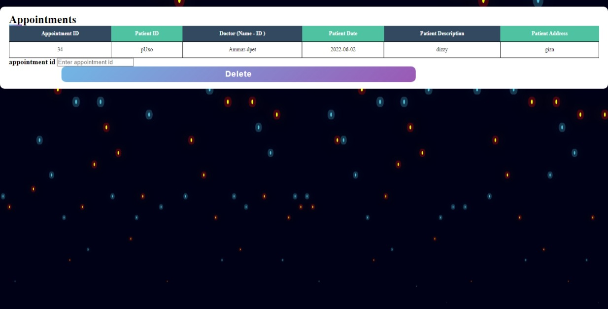

# Final-HIS-Hosbital-Information-System-web-app-project
-our project is a part of a more significant project which is HIS (Hospital Information System) is considered a web app for a hospital with a large database to facilitate the doctors and the hospital staff to organize their gadgets, rooms and medical reports of all patients in an efficient way also ease the patient to deal with hospitals in many ways like choose the doctors, make appointments and follow up with doctors with less effort.

-our part is an ophthalmology clinic that deals with eye and vision problems. we start our project with ordered steps : 
1- Identify our problem and start searching about the ophthalmology clinics' services and strat with our ER model to identify all entities and attributes we are going to deal with and we divided our team into three groups (front end  - back end - database)
2-then we made our relational model and started creating a database using MySQL.
3- we made our user interface using CSS and HTML and pick the inputs needed from the user to ease the patient as steve Krug said "Don't Make Me Think"
4- our back-end team use a python flask to connect between the front and the database of the project and ended up with our project.

-The database consists of three entities and three relations the image will be attached to the repo.
-some criteria should be achieved in our project:
1- different users can use our project and each category has a different staff ( doctors, patients, admin ).
2 Our application uses static files ( patients' scans )
3-responsivity means our application is available on mobile phones 
4-also there is a contact us form for any complains or special requests.

## Table of Contents

- [Built with](#Built-with)
- [Deployment](#Deployment)
- [Design](#Design)
- [Features](#Features)
- [Authors](#Authors)


## Built with


[](https://www.mysql.com/)


## Deployment

 Install Flask

```bash
  pip install Flask
```
To start deployment 
```bash
  flask run app.py
```

## 🖌️ Design

## Features
In our Hospital system there are different sections to be mentioned: 

0.An ER model (Entity-Relationship model) is a data model that represents the conceptual view of data in a database. The ER model is a graphical representation of entities (objects or concepts) and the relationships among them and the following image represents the er model of the our hospital and shows the relation between the admin, doctors, and patiens.



1.The start page which contains the log in tab for older users and sign up tab for the new users also contains about section which represents a little about our hospital, also contact us section to allow the users to contact with the hospital for any problems or recommendations.



2.Admin page: This page is only for admins that have a lot of tabs and fully control the data of the hospital and where we can add new accounts to doctors and also supervise the patient problems and recommendations.



3.Doctor page: Here is the page of the doctor where we can see the appointment tab which shows the doctor the weekly appointments and also the scans of the medical records of the patients to help him write an examination and prescription.



4.Patient page: This page is for patients where you can see the available doctors and book or delete appointments and see the written prescriptions.



5.An examples of appointments reservations table with the different informations needed



